# LSA64: A Dataset for Argentinian Sign Language


The sign database for the Argentinian Sign Language, created with the goal of producing a dictionary for LSA and training an automatic sign recognizer, includes 3200 videos where 10 non-expert subjects executed 5 repetitions of 64 different types of signs. Signs were selected among the most commonly used ones in the LSA lexicon, including both verbs and nouns.

## Signs

The following table lists the id, name and hands (H column) used in each sign. The column H specifies whether the sign was performed with the right hand (R) or both hands (B).

ID | Name  | H | ID | Name  | H | ID | Name  | H | ID | Name  | H |
|:-:|:-:|:-:|:-:|:-:|:-:|:-:|:-:|:-:|:-:|:-:|:-:|
01 | Opaque | R | 17 | Call | R | 33 | Hungry | R | 49 | Yogurt | B |
02 | Red | R | 18 | Skimmer | R | 34 | Map | B | 50 | Accept | B |
03 | Green | R | 19 | Bitter | R | 35 | Coin | B | 51 | Thanks | B |
04 | Yellow | R | 20 | Sweet milk | R | 36 | Music | B | 52 | Shut down | R |
05 | Bright | R | 21 | Milk | R | 37 | Ship | R | 53 | Appear | B |
06 | Light-blue | R | 22 | Water | R | 38 | None | R | 54 | To land | B |
07 | Colors | R | 23 | Food | R | 39 | Name | R | 55 | Catch | B |
08 | Red | R | 24 | Argentina | R | 40 | Patience | R | 56 | Help | B |
09 | Women | R | 25 | Uruguay | R | 41 | Perfume | R | 57 | Dance | B |
10 | Enemy | R | 26 | Country | R | 42 | Deaf | R | 58 | Bathe | B |
11 | Son | R | 27 | Last name | R | 43 | Trap | B | 59 | Buy | R |
12 | Man | R | 28 | Where | R | 44 | Rice | B | 60 | Copy | B |
13 | Away | R | 29 | Mock | B | 45 | Barbecue | B | 61 | Run | B |
14 | Drawer | R | 30 | Birthday | R | 46 | Candy | R | 62 | Realize | R |
15 | Born | R | 31 | Breakfast | B | 47 | Chewing-gum | R | 63 | Give | B |
16 | Learn | R | 32 | Photo | B | 48 | Spaghetti | B | 64 | Find | R |

## Recording

The database was recorded in two sets. In the first one, 23 one-handed signs were recorded. The second added 41 signs, 22 two-handed and 19 one-handed as well.

The first recording was done in an outdoors environment, with natural lightning, while the second in an indoors environment, with artificial lightning, to provide differences in illumination between signs.

Subject 10 from the first recordings was unavailable for the second set of recordings, and was replaced by another subject. This change in no way diminishes the utility of the dataset, since the set of classes recorded in the first session is disjoint from the one recorded in the second session.

In both sets of recordings, subjects wore black clothes and performed the signs standing or sitting, with a white wall as a background. To simplify the problem of hand segmentation within an image, subjects wore fluorescent-colored gloves. These  substantially simplify the problem of recognizing the position of the hand and performing its segmentation, and remove all issues associated to skin color variations, while fully retaining the difficulty of recognizing the handshape.

Each sign was executed imposing few constraints on the subjects to increase diversity and realism in the database. All subjects were non-signers and right-handed, were taught how to perform the signs during the recording session by showing them a video of the signs as performed by one of the authors, and practiced each sign a few times before recording.

The camera employed was the same in both sets of recording (Sony HDR-CX240). The tripod was placed 2m away from the wall at a height of 1.5m. Marks on the floor were used to indicate subjects where to position themselves. The resolution of the videos is 1920 by 1080, at 60 frames per second.


##  License 
This work is licensed under a [Creative Commons Attribution-NonCommercial-ShareAlike 4.0 International License](https://creativecommons.org/licenses/by-nc-sa/4.0/legalcode). 

This basically means that:

* Academic, educational or personal use is allowed without restrictions.
* You must share any derivative works under the same license (ie, preprocessed versions of the dataset, subsets, supersets using other datasets).
* You must mention this website or the article [LSA64: A Dataset of Argentinian Sign Language](http://sedici.unlp.edu.ar/bitstream/handle/10915/56764/Documento_completo.pdf-PDFA.pdf?sequence=1&isAllowed=y) whenever you share or mention the dataset.
* Commercial uses of the dataset are not allowed.

Please contact the authors if you are unsure about what constitutes fair use under this license, or need to use the dataset under a different license.

## Raw version
The raw version of the dataset contains one video for each sign in the dataset. Each video weights on average 600kb. The whole dataset weights 1.9gb.

* [Raw Version - Mega (1.9gb)](https://mega.nz/#!kJBDxLSL!zamibF1KPtgQFHn3RM0L1WBuhcBUvo0N0Uec9hczK_M)
* [Raw Version - Google Drive (1.9gb)](https://drive.google.com/file/d/1C7k_m2m4n5VzI4lljMoezc-uowDEgIUh/view?usp=sharing)

## Cut/temporally segmented version
The cut version is similar to the raw version but each video has been temporally segmented so that the frames in the beginning or end of the video with no movement in the hands were removed. Each video weights around 500kb on average and the whole dataset weights 1.5gb.

* [Cut Version - Mega (1.5gb) ](https://mega.nz/#!FQJGCYba!uJKGKLW1VlpCpLCrGVu89wyQnm9b4sKquCOEAjW5zMo)
* [Cut Version - Google Drive (1.5gb) ](https://drive.google.com/file/d/1C7k_m2m4n5VzI4lljMoezc-uowDEgIUh/view?usp=sharing)

## Pre-preprocessed version
We provide a pre-processed version of the dataset to alleviate the overhead of performing experiments with the data.

From the dataset we extracted the hand and head positions for each frame, along with images of each hand. Each image was segmented, leaving only the hand with a black background.

The tracking and segmentation of the hands uses the techniques described is the same as the one used to pre-process the LSA16 handshape dataset [LSA64](../lsa16/index.html). Additionally, the head of the subject is tracked via the Viola-Jones's face detector. The 2D position of each hand is then transformed to be relative to the that of the head. The positions are then normalized by dividing by the arm's length of the subject, measured in centimeters/pixels. In this way, the transformed positions represent distances from the head, in units of centimeters.

The result of this process is a sequence of frame information, in which for each frame we calculate the position of both hands, and we extract an image of each hand with the background segmented.

The preprocessed version contains a Matlab file with the positions of the hands of the subject for each frame (normalized wrt the head position), and a set of hand videos, one for each repetition of each sign and each hand.

* [Preprocessed Version (800mb) - Mega](https://drive.google.com/file/d/18VuWBAxHaSBbO7wx57kQVre78FN7GYzQ/view?usp=sharing)
* [Preprocessed Version (800mb) - Google Drive](https://drive.google.com/file/d/1yhfPpI2iJzPXyx4C7MYR6IPZC3YuuYaL/view?usp=sharing)


## Citing

If you use the dataset, we kindly ask you to cite [LSA64: A Dataset of Argentinian Sign Language](http://sedici.unlp.edu.ar/bitstream/handle/10915/56764/Documento_completo.pdf-PDFA.pdf?sequence=1&isAllowed=y):

```
@Article{Ronchetti2016,
author="Ronchetti, Franco and Quiroga, Facundo and Estrebou, Cesar and Lanzarini, Laura and Rosete, Alejandro",
title="LSA64: A Dataset of Argentinian Sign Language",
journal="XX II Congreso Argentino de Ciencias de la Computación (CACIC)",
year="2016"
}

```

<!--
volume="XX",
number="XX",
pages="XX--YY",
issn="XXXX-YYYY"
-->

## Projects and articles using/citing LSA64
* [Sign Language Classification using Convolutional Neural Networks (masters project)](https://github.com/frankibem/CS_6001)
* [Sign Language Recognition Based on 3D Convolutional Neural Networks](https://link.springer.com/chapter/10.1007/978-3-319-93000-8_45)
* [LSA64: A Dataset of Argentinian Sign Language](http://sedici.unlp.edu.ar/bitstream/handle/10915/56764/Documento_completo.pdf-PDFA.pdf?sequence=1&isAllowed=y)
* [Sign Languague Recognition Without Frame-Sequencing Constraints: A Proof of Concept on the Argentinian Sign Language](https://link.springer.com/chapter/10.1007/978-3-319-47955-2_28)
* [Sign Language Recognition based on hand and body skeletal data](https://www.iti.gr/iti/files/document/publications/paper_v3.pdf)
* [A deep learning approach for analyzing video and skeletal features in sign language recognition](https://ieeexplore.ieee.org/abstract/document/8577085/)
* [Sign language dataset loading library (python, github)](https://github.com/midusi/sign_language_datasets)
* [Sign Language Gesture Recognition From Video Sequences Using RNN And CNN](Sign Language Gesture Recognition From Video Sequences Using RNN And CNN) [github ](https://github.com/hthuwal/sign-language-gesture-recognition)


## Samples

Sample snapshots of the dataset. The images on the left (first column) are from the first set of recordings.

|:-------------------:|:--------------------:|:-------------------:|
|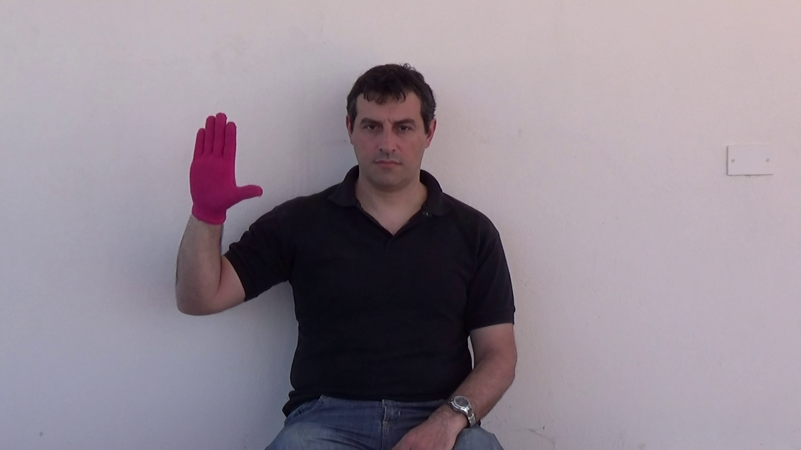  |  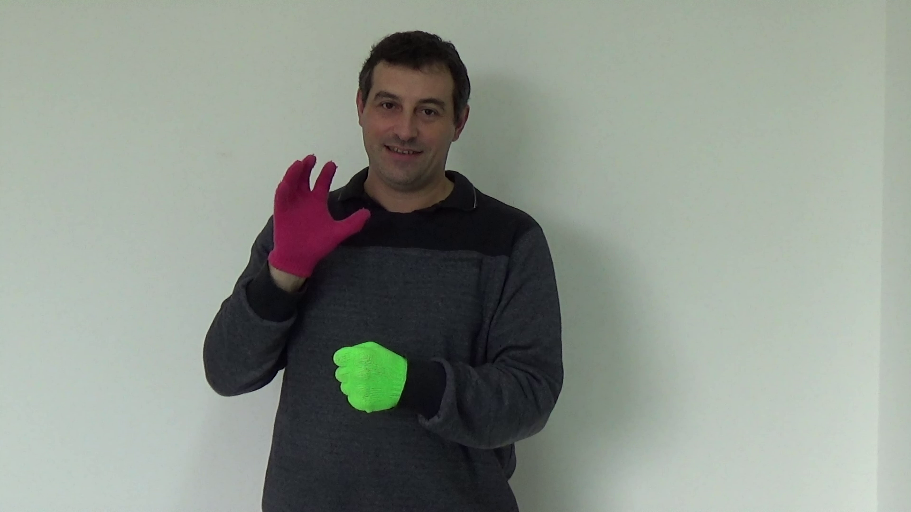 | 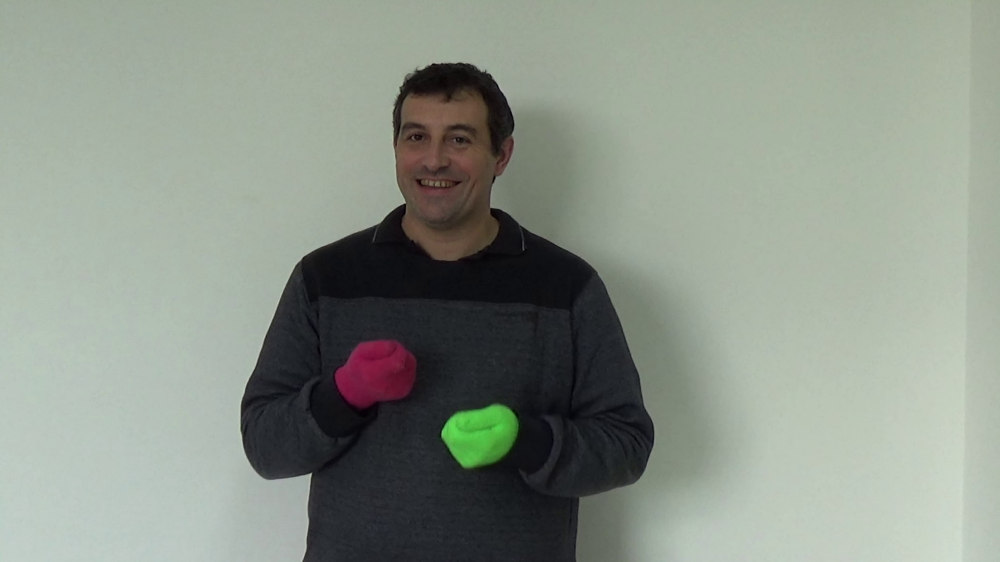 |
|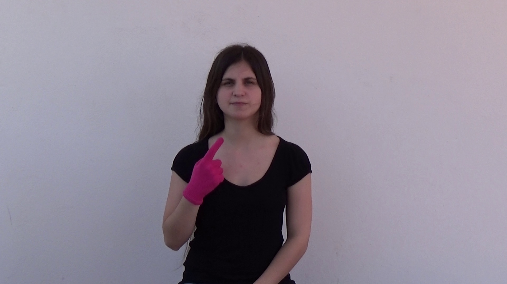  |   | 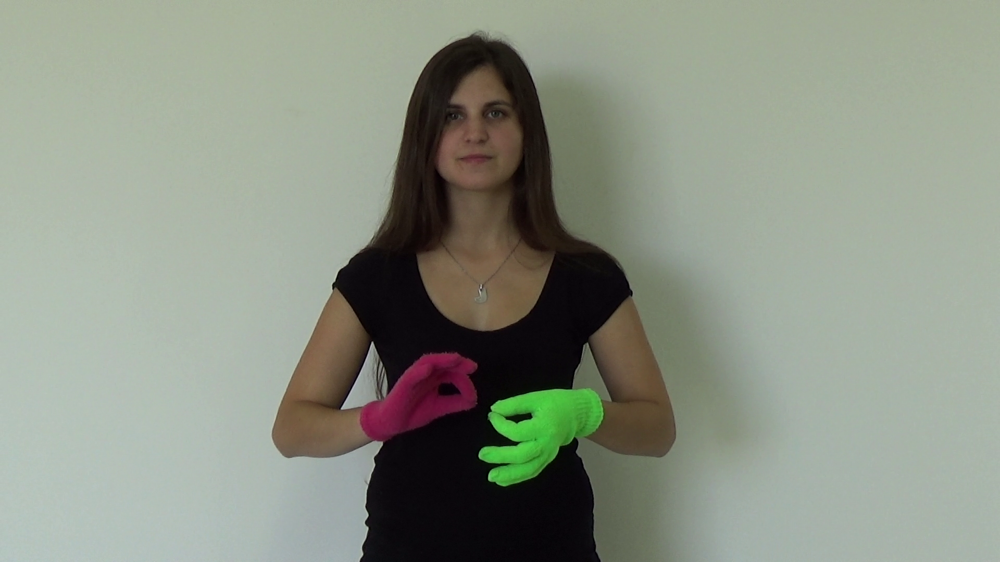 |

## Statistics

### Position

Mean initial and final position of each class of sign, for the left and right hand. The circle/ellipse size is proportional to the covariance of the position around the mean, which is the center of each ellipse.

|Left hand, initial position|  Left hand, final position|
|:-------------------------:|:-------------------------:|
| 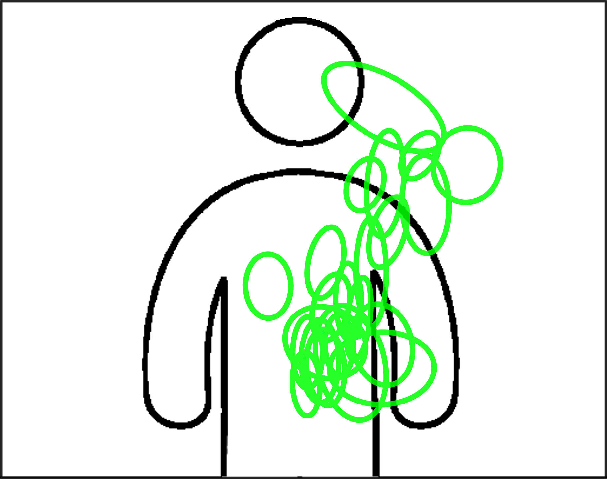 | 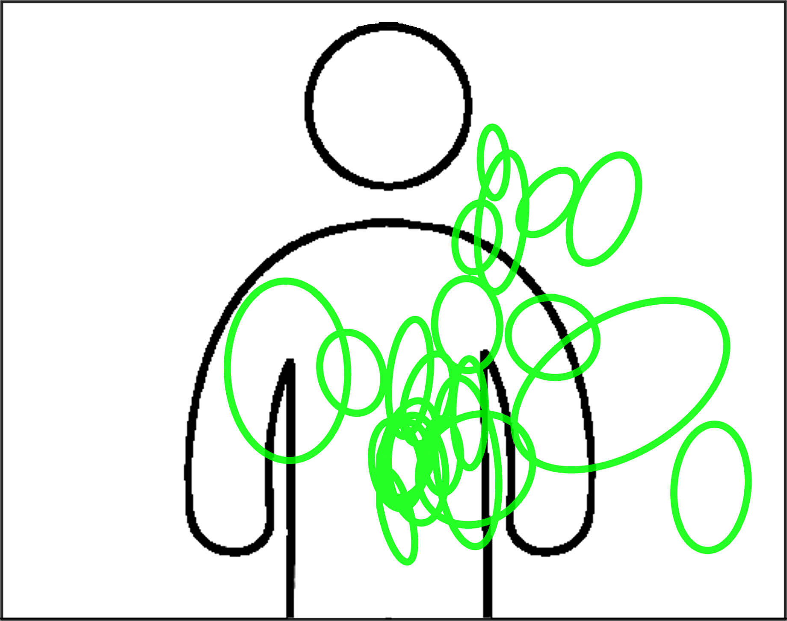|

|Right hand, initial position|  Right hand, final position|
|:-------------------------:|:-------------------------:|
| 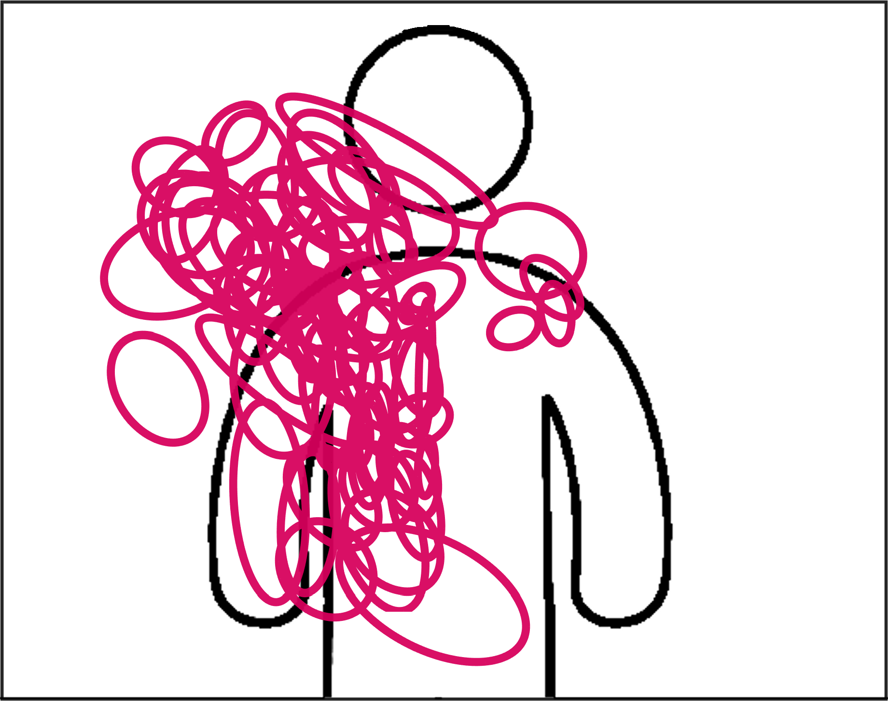 | 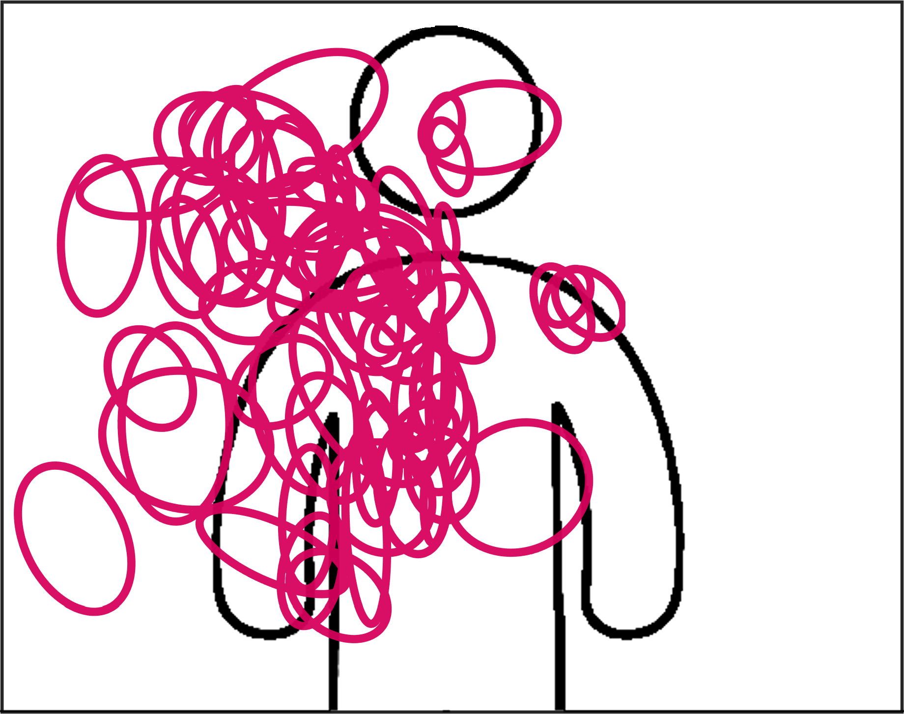|


### Trajectories
Sample trajectories of the right hand (purple) and left hand (green) of samples performed by subject 2.
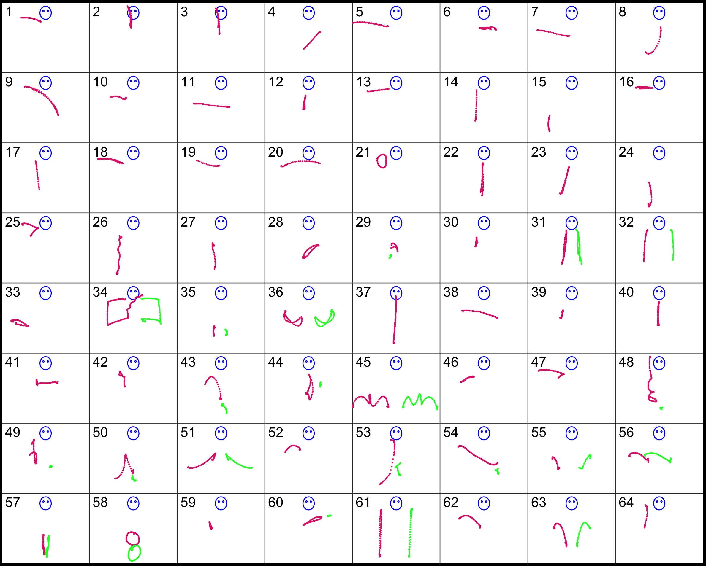

### Handshapes

Sample handshapes. We show the first frame of the first repetition of each class of sign by subject 1.

#### Right hand handshapes
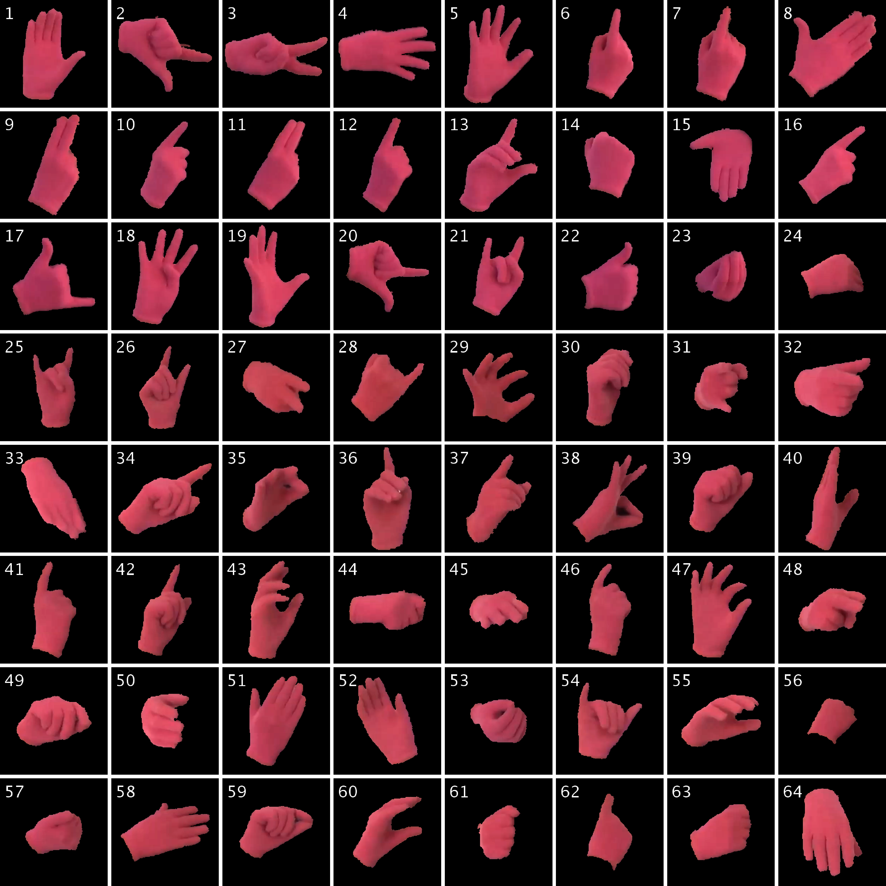

#### Left hand handshapes
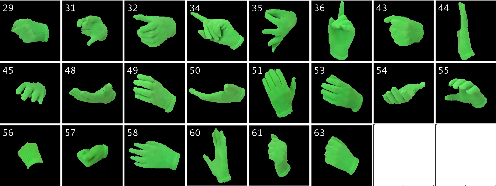


## Contact


 Facundo Manuel Quiroga
{fquiroga}-at-lidi.info.unlp.edu.ar

[III-LIDI](http://www.lidi.info.unlp.edu.ar/) Informatics Institute
[Informatics Faculty](http://info.unlp.edu.ar/)
[UNLP](http://unlp.edu.ar/)
