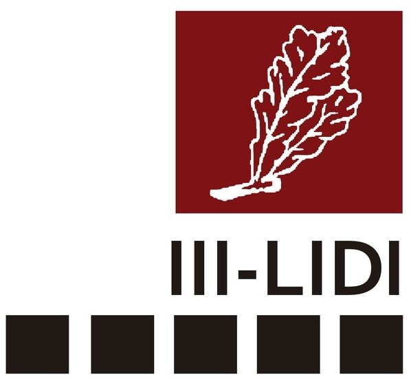
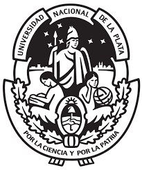

I'm a researcher working on Machine Learning and Computer Vision at the 
[Instituto de Investigación en Informática LIDI](), [Facultad de Informática](http://info.unlp.edu.ar), [UNLP](http://unlp.edu.ar)

### Research areas

* [Invariance and Equivariance in Neural Networks](https://github.com/facundoq/transformational_measures)
* [Sign Language Recognition](/sign_language)
* [Stellar classificaction](publications/bestars/presentation.pdf)

### Contact
Mail: f{lastname}@lidi.info.unlp.edu.ar 

### Affiliations

 

