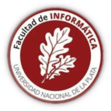

I'm a researcher working on Machine Learning and Computer Vision at the 
[Instituto de Investigación en Informática LIDI](), [Facultad de Informática](http://info.unlp.edu.ar), [UNLP](http://unlp.edu.ar).

I'm teaching [Intro to Computer Architecture](https://facundoq.github.io/courses/arq/) in the second semester of 2023, and usually teach Data Mining in the first semester. I've also taught several [posgraduate courses](teaching).

### Research areas

* [Interpretability for Neural Networks](interpretability)
* [Sign Language Processing](sign_language)
* [Astronomical data](astro)

You can also find other [random projects I've worked on](projects) such as [VonSim](https://vonsim.github.io/) or [EduNN](https://github.com/facundoq/edunn)

### Contact
Mail: f{lastname}@lidi.info.unlp.edu.ar 

### Affiliations

 

