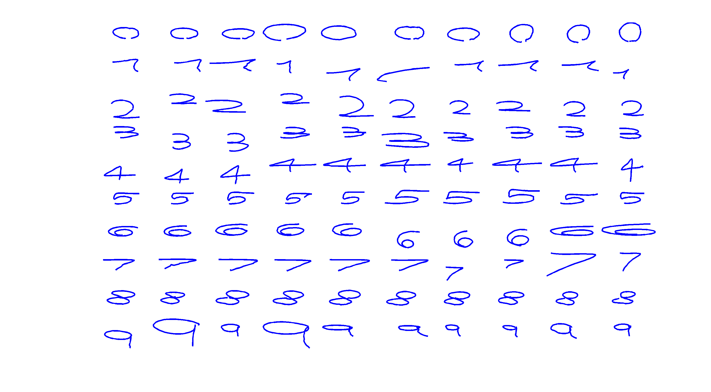

# Kinect Numbers and Letters Hand Gestures Datasets


## Description

The Letters and Numbers Hand Gestures (LNHG) Database is a small dataset intended for gesture recognition.

The dataset contains 36 classes. The 36 classes consist of the arabic digits `(0, 1, ..., 9)` (10 classes) and latin/roman alphabet letters `(a, b, ..., z)` (26 classes).

There are 10 samples per digit gesture and 20 samples per letter gesture, for a total of `10*10+26*20 = 100+520 = 620` samples.


## Samples

The following image shows the 2D projection of 3D segmented hand gestures. The 100 samples of digits are shown. Some digits may *appear* distorted because of the projection from 3D to 2D:




### Recording

The gestures were all performed by the same subject using the left hand and recorded with Microsoft Kinect's SDK.

The recording of all samples was done at an average of 28 fps.

In the recording of the different samples of each gesture the orientation of the subject with respect to the camera was maintained, but the samples were performed starting from different positions and with different sizes.

## Data format

The segmented gesture data consists of a csv file in which each line corresponds to a sample, in the following format:

````
gesture_class_name,gesture_class_code,x_1,y_1,z_1,x_2,y_2,z_2,...,x_n
````

where `x_i,y_i,z_i` are the `x`, `y` and `z` coordinates of the hand in frame `i` in Kinect's  virtual space. Each sample may have a different number of frames, according to the duration of the gesture and the frame rate of the recording. The samples are ordered by `gesture_class_code`.

## Dataset files

You can download all the gesture data (620 samples), or the letters (520 samples) and numbers (100 samples) separately. Note that the ids/labels for the combined dataset go from 0 to 35, while the individual datasets have their own labels (0 to 25 for the letters, and 0 to 9 for the digits).

* [Letters and numbers](data/letters_numbers.csv)
* [Letters only](data/letters.csv)
* [Numbers only](data/numbers.csv)


## Loading the dataset with Matlab/Octave

We provide Matlab/Octave  code for reading the segmented gesture data into a cell array of matrices, where each element of the cell array `xs` corresponds to a sample, represented by a matrix of 3xNi, where Ni is the number of frames recorded for that sample.

The vector `ys` contains the gesture_class_code for each of the samples and gesture_names is a cell array of 10 elements with the name of each gesture (ie: `'zero'`, `'one'`).

* [Matlab/Octave dataset loading script](code/read_gestures.m)


## Citing

If you use the dataset, we kindly ask you to cite [A novel competitive neural classifier for gesture recognition with small training sets](http://sedici.unlp.edu.ar/bitstream/handle/10915/31580/Documento_completo.pdf?sequence=1):

```
@inproceedings{quiroga2013novel,
  title={A novel competitive neural classifier for gesture recognition with small training sets},
  author={Quiroga, Facundo and Corbal{\'a}n, Leonardo C{\'e}sar},
  booktitle={XVIII Congreso Argentino de Ciencias de la Computaci{\'o}n (CACIC)},
  year={2013}
}

```

## License 
This work is licensed under a [Creative Commons Attribution-NonCommercial-NoDerivatives 4.0 International License](http://creativecommons.org/licenses/by-nc-nd/4.0/). The dataset is made available strictly for academic purposes. No derivative works or commercial use are allowed. Please contact the authors if you are unsure about what constitutes fair use under this license, or need to use the dataset under a different license.


## Contact


[Facundo Manuel Quiroga](http://facundoq.github.io)

{fquiroga}-at-lidi.info.unlp.edu.ar

[III-LIDI](http://www.lidi.info.unlp.edu.ar/) Informatics Institute
[Informatics Faculty](http://info.unlp.edu.ar/)
[UNLP](http://unlp.edu.ar/)
