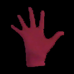
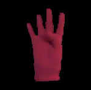
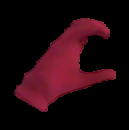
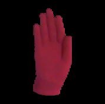
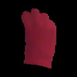
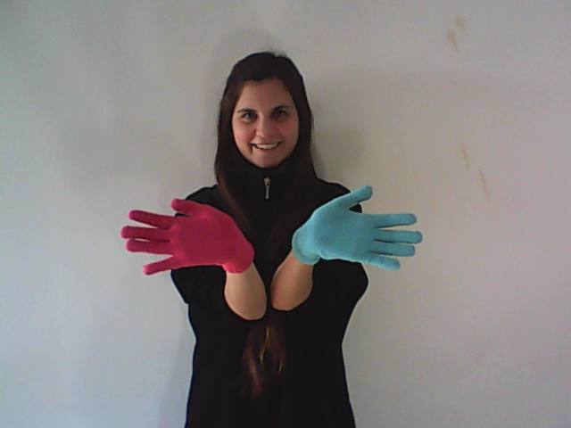
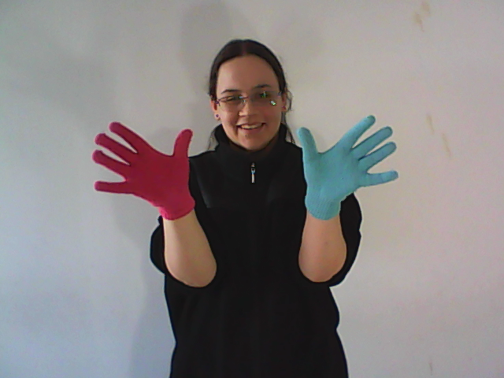
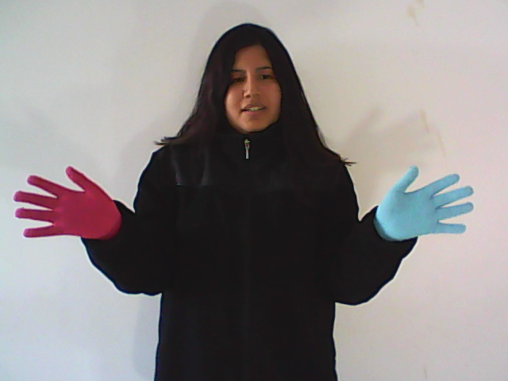
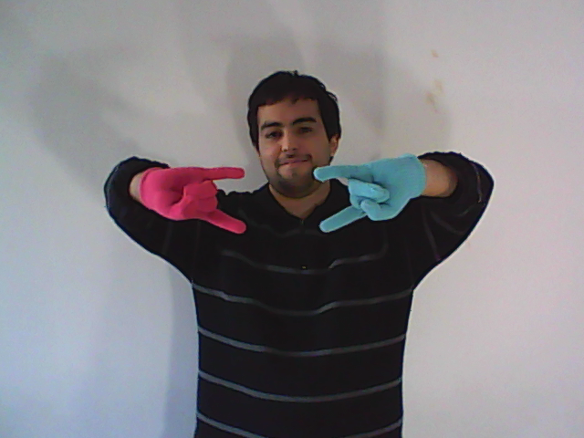

# LSA16: A Handshape Dataset for Argentinian Sign Language

This database contains images of 16 hand configurations of the Argentinian Sign Language (LSA), each performed 5 times by 10 different subjects, for a total of 800 images. The subjects wore color hand gloves and black clothes.

## Handshapes

The following table lists the id and name of each handshape, along with a sample.

ID | Name  | Sample | ID | Name  | Sample | ID | Name  | Sample | ID | Name  | Sample |
|:-:|:-:|:-:|:-:|:-:|:-:|:-:|:-:|:-:|:-:|:-:|:-:|
01 | Five |  | 02 | Four |  | 03 | Horns |  | 04 | Curve |  |
05 | Fingers together |  | 06 | Double |  | 07 | Hook |  | 08 | Index |  |
09 | L |  | 10 | Flat Hand |  | 11 | Mitten |  | 12 | Beak |  |
13 | Thumb |  | 14 | Fist |  | 15 | Telephone |  | 16 | V |  |

## Shooting

The dataset was recorded in an indoors environment, with artificial lightning, to provide differences in illumination between signs.

In both sets of recordings, subjects wore black clothes and performed the signs standing or sitting, with a white wall as a background. To simplify the problem of hand segmentation within an image, subjects wore fluorescent-colored gloves. These substantially simplify the problem of recognizing the position of the hand and performing its segmentation, and remove all issues associated to skin color variations, while fully retaining the difficulty of recognizing the handshape.

Each handshape was executed imposing few constraints on the subjects to increase diversity and realism in the database. All subjects were non-signers and right-handed, were taught how to perform the handshape during the shooting session by showing them an image of the handshape as performed by one of the authors, and practiced each handshape a few times before recording.

We employed a generic webcam for the recording.

## Raw version
The raw version of the dataset contains one image for each sign in the dataset. Each image is on average XXmb.

The filename of each image specifies its class, subject, and repetition, in the format CLASS_SUBJECT_REPETITION.png, so that the image 3_2_4.png corresponds to the 4th repetition of handshape 3 (Horns), as performed by subject 2.

[Download Raw Version (XXmb)](files/lsa16.zip)

## Pre-preprocessed version
We provide a pre-processed version of the dataset to reduce the overhead of performing experiments with the data. From each image we extracted the hand and segmented it, replacing the background with black pixels. The filename format is the same as in the raw version

[Download Preprocessed Version (7mb)](files/lsa16_preprocessed.zip)

## Samples

Sample images of the dataset.

|:-------------------:|:--------------------:|:-------------------:|
|  |   |  |
|  |   |  |

## License 
This work is licensed under a [Creative Commons Attribution-NonCommercial-NoDerivatives 4.0 International License](http://creativecommons.org/licenses/by-nc-nd/4.0/). The database is made available strictly for academic purposes. No derivative works or commercial use are allowed.  Please contact the authors if you are unsure about what constitutes fair use under this license.

## Contact

Facundo Manuel Quiroga
{fquiroga}-at-lidi.info.unlp.edu.ar

[III-LIDI](http://www.lidi.info.unlp.edu.ar/) Informatics Institute
[Informatics Faculty](http://info.unlp.edu.ar/)
[UNLP](http://unlp.edu.ar/)
