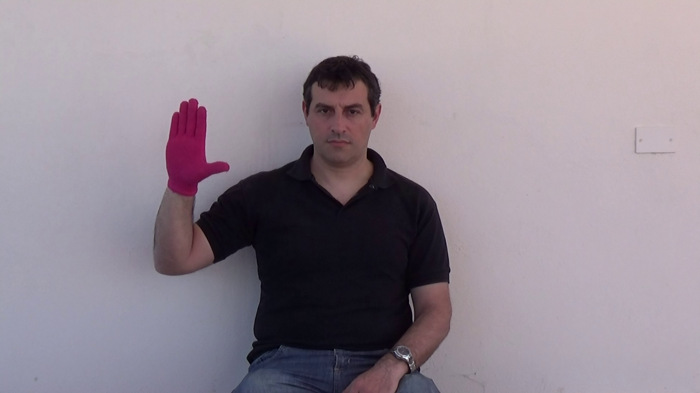
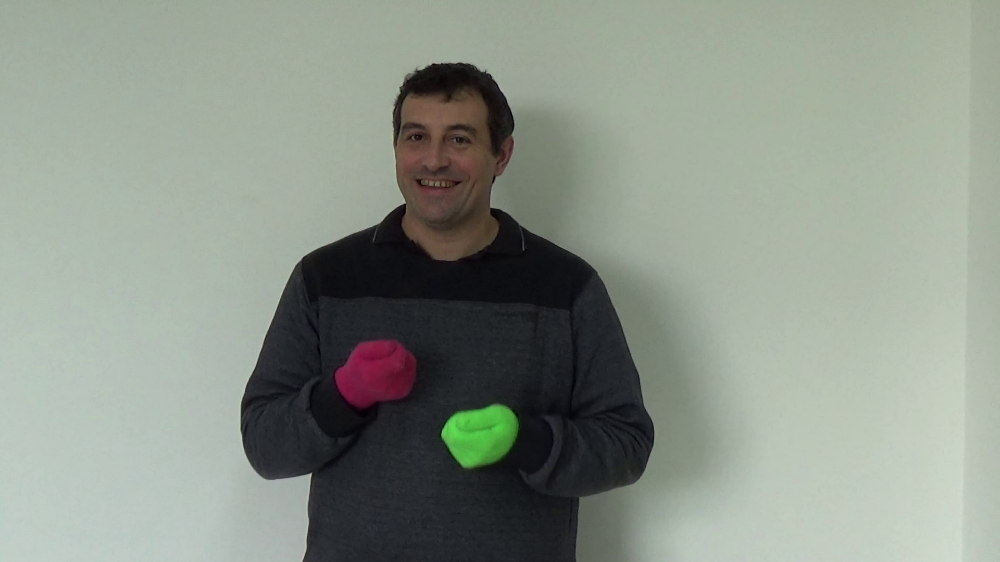
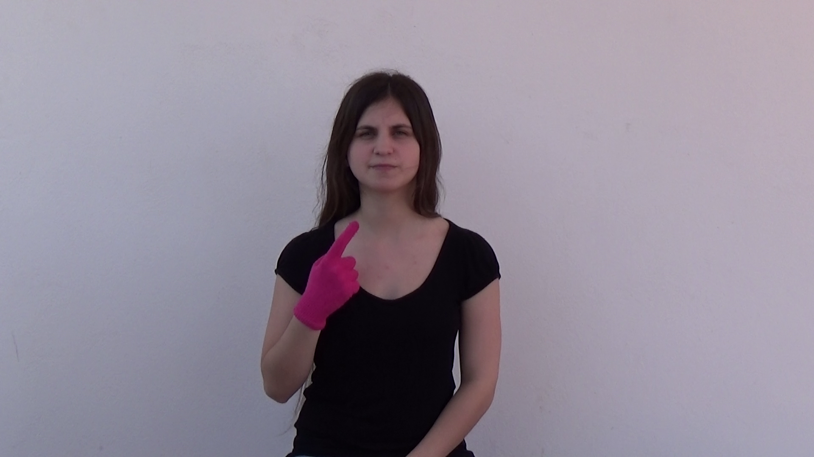
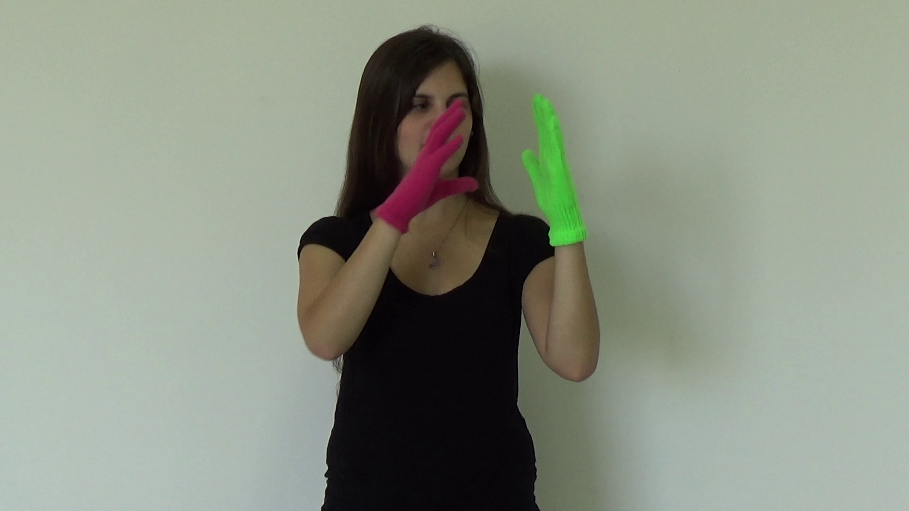
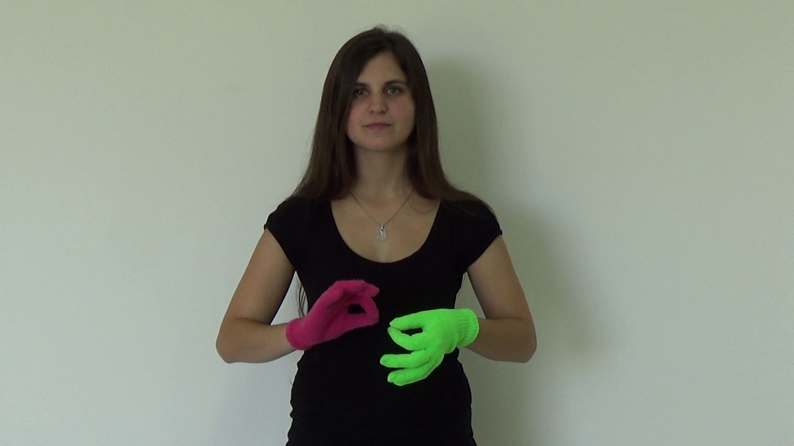
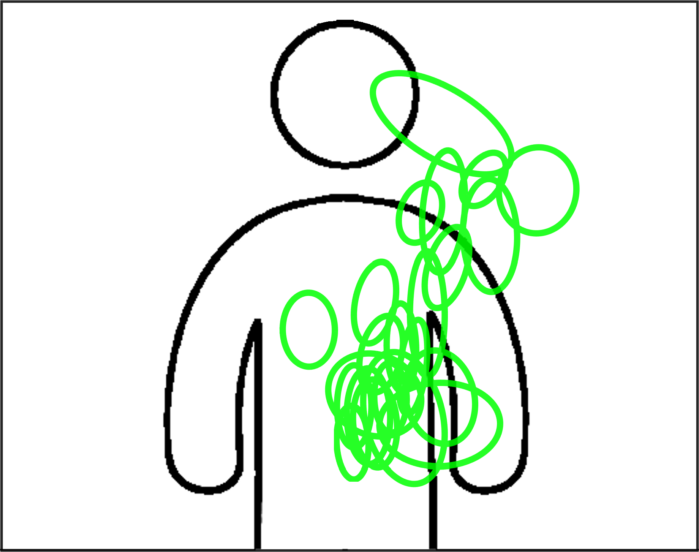
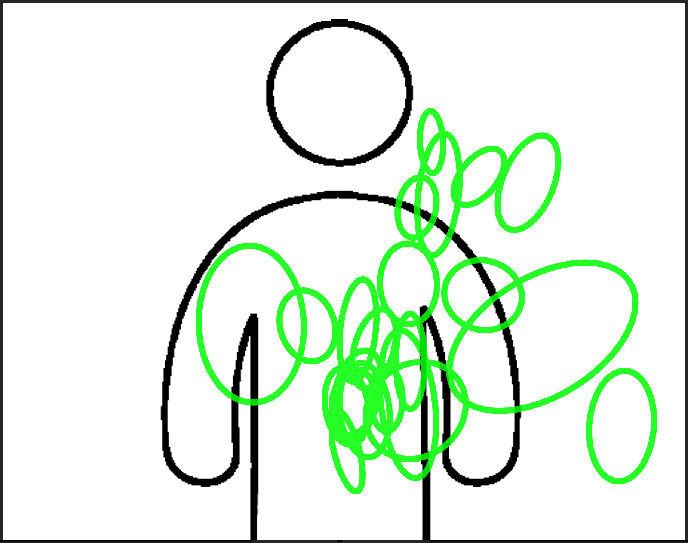
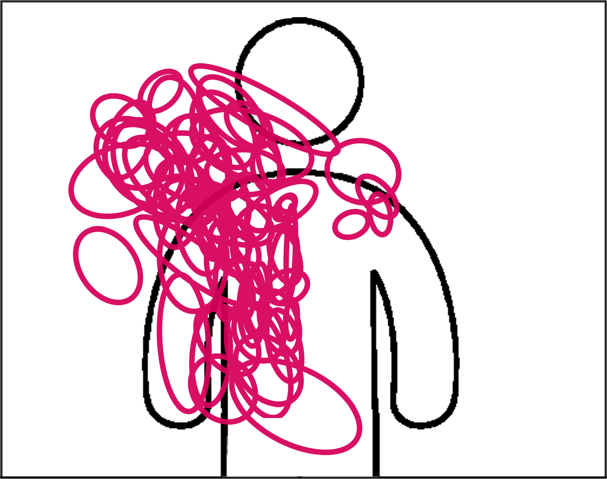
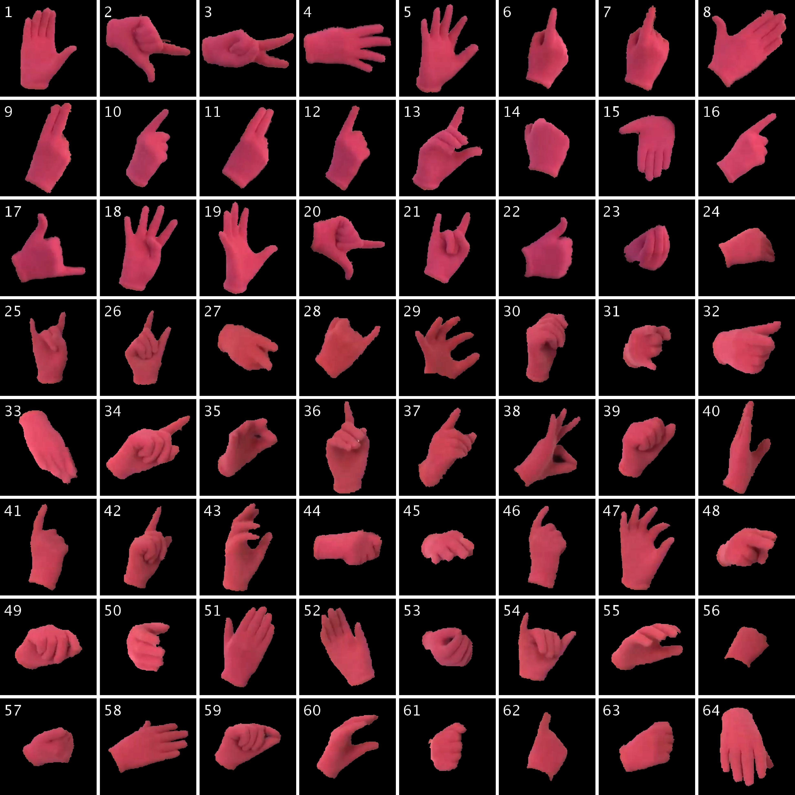

# LSA64: A Dataset for Argentinian Sign Language

The sign database for the Argentinian Sign Language, created with the goal of producing a dictionary for LSA and training an automatic sign recognizer, includes 3200 videos where 10 non-expert subjects executed 5 repetitions of 64 different types of signs. Signs were selected among the most commonly used ones in the LSA lexicon, including both verbs and nouns.

## Signs

The following table lists the id, name and hands (H column) used in each sign. The column H specifies whether the sign was performed with the right hand (R) or both hands (B).

ID | Name  | H | ID | Name  | H | ID | Name  | H | ID | Name  | H |
|:-:|:-:|:-:|:-:|:-:|:-:|:-:|:-:|:-:|:-:|:-:|:-:|
01 | Opaque | R | 17 | Call | R | 33 | Hungry | R | 49 | Yogurt | B |
02 | Red | R | 18 | Skimmer | R | 34 | Map | B | 50 | Accept | B |
03 | Green | R | 19 | Bitter | R | 35 | Coin | B | 51 | Thanks | B |
04 | Yellow | R | 20 | Sweet milk | R | 36 | Music | B | 52 | Shut down | R |
05 | Bright | R | 21 | Milk | R | 37 | Ship | R | 53 | Appear | B |
06 | Light-blue | R | 22 | Water | R | 38 | None | R | 54 | Land | B |
07 | Colors | R | 23 | Food | R | 39 | Name | R | 55 | Catch | B |
08 | Red | R | 24 | Argentina | R | 40 | Patience | R | 56 | Help | B |
09 | Women | R | 25 | Uruguay | R | 41 | Perfume | R | 57 | Dance | B |
10 | Enemy | R | 26 | Country | R | 42 | Deaf | R | 58 | Bathe | B |
11 | Son | R | 27 | Last name | R | 43 | Trap | B | 59 | Buy | R |
12 | Man | R | 28 | Where | R | 44 | Rice | B | 60 | Copy | B |
13 | Away | R | 29 | Mock | B | 45 | Barbecue | B | 61 | Run | B |
14 | Drawer | R | 30 | Birthday | R | 46 | Candy | R | 62 | Realize | R |
15 | Born | R | 31 | Breakfast | B | 47 | Chewing-gum | R | 63 | Give | B |
16 | Learn | R | 32 | Photo | B | 48 | Spaghetti | B | 64 | Find | R |

## Recording

The database was recorded in two sets. In the first one, 23 one-handed signs were recorded. The second added 41 signs, 22 two-handed and 19 one-handed as well.

The first recording was done in an outdoors environment, with natural lightning, while the second in an indoors environment, with artificial lightning, to provide differences in illumination between signs.

Subject 10 from the first recordings was unavailable for the second set of recordings, and was replaced by another subject. This change in no way diminishes the utility of the dataset, since the set of classes recorded in the first session is disjoint from the one recorded in the second session.

In both sets of recordings, subjects wore black clothes and performed the signs standing or sitting, with a white wall as a background. To simplify the problem of hand segmentation within an image, subjects wore fluorescent-colored gloves. These  substantially simplify the problem of recognizing the position of the hand and performing its segmentation, and remove all issues associated to skin color variations, while fully retaining the difficulty of recognizing the handshape.

Each sign was executed imposing few constraints on the subjects to increase diversity and realism in the database. All subjects were non-signers and right-handed, were taught how to perform the signs during the recording session by showing them a video of the signs as performed by one of the authors, and practiced each sign a few times before recording.

The camera employed was the same in both sets of recording (Sony HDR-CX240). The tripod was placed 2m away from the wall at a height of 1.5m. Marks on the floor were used to indicate subjects where to position themselves. The resolution of the videos is 1920 by 1080, at 60 frames per second.

## Raw version
The raw version of the dataset contains one video for each sign in the dataset. Each video is on average XXmb. The whole dataset weights 2.1gb.

[Download Raw Version](http://www.soon.com/lsa64raw.zip)

## Pre-preprocessed version
We provide a pre-processed version of the dataset to alleviate the overhead of performing experiments with the data.

From the dataset we extracted the hand and head positions for each frame, along with images of each hand, segmented and with a black background

The tracking and segmentation of the hands uses the techniques described in the work of Ronchetti2016, and the technique is the same as the one used to pre-process the LSA handshape dataset [LSA64](../lsa16/index.html). Additionally, the head of the subject is tracked via the Viola-Jones's face detector. The 2D position of each hand is then transformed to be relative to the that of the head. The positions are then normalized by dividing by the arm's length of the subject, measured in centimeters/pixels. In this way, the transformed positions represent distances from the head, in units of centimeters.

The result of this process is a sequence of frame information, in which for each frame we calculate the position of both hands, and we extract an image of each hand with the background segmented.

[Download Preprocessed Version (XXmb)](http://www.soon.com/lsa64preprocessed)

## Samples

Sample snapshots of the dataset. The images on the left (first column) are from the first set of recordings.

|:-------------------:|:--------------------:|:-------------------:|
|  |   |  |
|  |   |  |

## Statistics

### Position

Mean initial and final position of each class of sign, for the left and right hand. The circle shows the covariance of the position around the mean, which is the center of each circle.

|Left hand, initial position|  Left hand, final position|
|:-------------------------:|:-------------------------:|
|  | |

|Right hand, initial position|  Right hand, final position|
|:-------------------------:|:-------------------------:|
|  | |

### Trajectories
Sample trajectories of the right hand (purple) and left hand (green) of samples performed by subject 2.

### Handshapes

Sample handshapes. We show the first frame of the first repetition of each class of sign by subject 1.

#### Right hand handshapes

#### Left hand handshapes

## License 
This work is licensed under a Creative Commons Attribution-NonCommercial-NoDerivatives 4.0 International License](http://creativecommons.org/licenses/by-nc-nd/4.0/). The database is made available strictly for academic purposes. No derivative works or commercial use are allowed. Please contact the authors if you are unsure about what constitutes fair use under this license.

## Contact

Facundo Manuel Quiroga
{fquiroga}-at-lidi.info.unlp.edu.ar

[III-LIDI](http://www.lidi.info.unlp.edu.ar/) Informatics Institute
[Informatics Faculty](http://info.unlp.edu.ar/)
[UNLP](http://unlp.edu.ar/)
